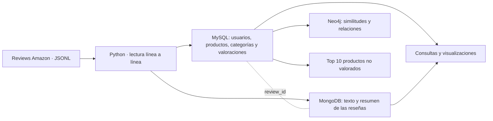
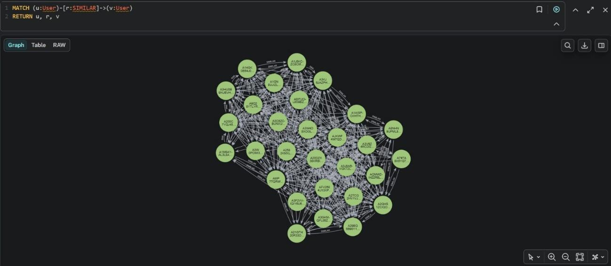

# Amazon Reviews · MySQL, MongoDB y Neo4j

**Sistema en Python para cargar, consultar y visualizar reseñas de Amazon con tres modelos de bases de datos.**

Portfolio de **[Enrique Capella Magallón](https://github.com/enrcap)** · Ingeniería Matemática e Inteligencia Artificial · ICAI.

El proyecto conecta almacenamiento relacional, documentos y grafos para explorar el comportamiento de usuarios y productos. Incluye carga de JSON línea a línea, consultas analíticas, siete visualizaciones, cuatro análisis en Neo4j y un recomendador de productos populares que el usuario todavía no ha valorado.

**Python · SQL · MySQL · MongoDB · Cypher · Neo4j · Matplotlib · WordCloud · Power BI**

## Arquitectura



| Base de datos | Información | Motivo |
| --- | --- | --- |
| MySQL | Usuarios, categorías, productos, puntuación, fechas y votos de utilidad | Claves, relaciones y agregaciones SQL |
| MongoDB | `reviewText`, `summary`, `helpful` y `review_id` | Documentos para contenido textual, enlazados con SQL |
| Neo4j | Usuarios, artículos, categorías y sus relaciones | Explorar similitudes y conexiones mediante grafos |

El campo `review_id` enlaza la parte estructurada de MySQL con el documento correspondiente de MongoDB. La información `helpful` se conserva en ambos modelos según el diseño original.

## Funcionalidades

- **Carga de datos:** crea las tablas y la colección, procesa un registro por línea y reutiliza usuarios presentes en distintas categorías.
- **Analítica:** evolución anual, popularidad de productos, distribución de notas, evolución acumulada, actividad por usuario, nubes de palabras y nota media por categoría.
- **Grafos:** correlación de Pearson entre usuarios, valoraciones usuario–artículo, usuarios con varias categorías y productos compartidos.
- **Ampliación:** incorpora Sports and Outdoors y comprueba si cada review ya existe antes de insertarla.
- **Recomendación:** obtiene hasta diez productos de una categoría ordenados por número de reviews, excluyendo los que el usuario ya ha valorado.
- **Power BI:** la memoria incluye tres visualizaciones realizadas con esa herramienta.

El recomendador implementado es una **referencia basada en popularidad**. La propuesta de KNN descrita en la memoria es una línea de trabajo futura, no un modelo entrenado en este repositorio.

## Ejemplo visual



Captura extraída de la memoria original.

Consulta el [modelo de datos y las decisiones técnicas](docs/arquitectura.md), la [memoria original](docs/memoria-original.pdf) y el [póster](docs/poster-original.pdf).

## Ejecutar el proyecto

### 1. Preparar Python

Se recomienda Python 3.12. Desde la raíz del repositorio:

```bash
python -m venv .venv
```

Activación en Windows PowerShell:

```powershell
.venv\Scripts\Activate.ps1
```

En macOS o Linux: `source .venv/bin/activate`.

```bash
python -m pip install -r requirements.txt
```

### 2. Configurar las conexiones

Copiar `.env.example` a `.env` y sustituir las contraseñas de ejemplo. En PowerShell:

```powershell
Copy-Item .env.example .env
```

El archivo `.env` está excluido de Git. Las variables del entorno tienen prioridad sobre él. Las rutas de los JSON se resuelven desde la raíz del repositorio.

Puede usarse una instalación propia de las tres bases de datos o el entorno local opcional de Docker Compose:

```bash
docker compose up -d
docker compose ps
```

Esperar a que los servicios estén listos. Neo4j Browser estará en `http://localhost:7474`, con el usuario `neo4j` y la contraseña elegida en `.env`. El entorno de Compose publica los puertos únicamente en `127.0.0.1`; MongoDB se configura sin autenticación para esta demostración local. Los volúmenes conservan los datos entre reinicios.

### 3. Obtener los datos

Los JSON originales no están incluidos. Descargar los subconjuntos **5-core de Amazon Reviews 2014**, descomprimirlos y colocarlos en `data/` siguiendo [estas instrucciones](data/README.md). Las versiones de 2018 y 2023 tienen otros tamaños y no son las usadas en la memoria.

### 4. Cargar y explorar

Ejecutar la carga inicial **una sola vez sobre bases dedicadas y vacías**:

```bash
python src/load_data.py
```

Abrir las herramientas según el análisis deseado:

```bash
python src/menu_visualizacion.py
python src/neo4JProyecto.py
python src/recomendador.py
```

Después de la carga inicial, añadir la quinta categoría con:

```bash
python src/inserta_dataset.py
```

Cada opción de grafos sustituye la visualización anterior del proyecto. En esta versión el borrado se limita a los nodos `AmazonReviewsProject` y sus relaciones. Para verlos en Neo4j Browser:

```cypher
MATCH (n:AmazonReviewsProject) RETURN n
```

### 5. Comprobar la lógica

```bash
python -m unittest discover -s tests -v
```

Las pruebas utilizan entradas sintéticas, conexiones simuladas y SQLite para comprobar la lógica de la consulta de recomendación. No sustituyen la prueba de integración en MySQL, MongoDB y Neo4j. El [registro de validación](docs/validacion.md) indica qué se ha comprobado.

## Estructura

```text
src/                 Configuración, carga, visualización, grafos y recomendador
data/README.md       Procedencia y descarga de los datos
docs/                Arquitectura, validación, memoria y póster originales
assets/              Imagen procedente de la memoria
tests/               Comprobaciones de lógica con datos sintéticos
.env.example         Plantilla de configuración sin secretos
compose.yaml         Servicios locales opcionales
requirements.txt     Dependencias de Python
```

## Alcance y mejoras pendientes

- La carga inicial no evita duplicar reviews si se repite. La comprobación de duplicados está implementada en el módulo de ampliación.
- MySQL y MongoDB no comparten una transacción. Un fallo parcial puede dejar datos desalineados; una versión de producción necesita recuperación, conciliación e inserciones idempotentes.
- La carga lee línea a línea, pero algunas consultas y visualizaciones recuperan conjuntos completos de resultados. No es una garantía de memoria constante para toda la aplicación.
- El modelo asocia cada producto a una categoría. Si el mismo ASIN aparece en varias, conserva la primera asociación.
- La similitud calcula Pearson sobre los productos comunes. La formulación del enunciado usa medias globales del usuario; esta diferencia se documenta en la arquitectura.
- No hay evaluación predictiva del recomendador ni métricas de ranking en un conjunto de test.

## Contexto y documentación

Proyecto académico de Bases de Datos, ICAI, abril de 2026. **Responsable de este repositorio: Enrique Capella Magallón.** Los documentos originales se conservan con sus créditos y resultados de la entrega. Los cambios de preparación del portfolio se detallan en [docs/cambios.md](docs/cambios.md).

El código y los documentos no tienen una licencia de software añadida. Los datos externos conservan sus propias condiciones de uso; este repositorio no redistribuye los JSON de reviews.
