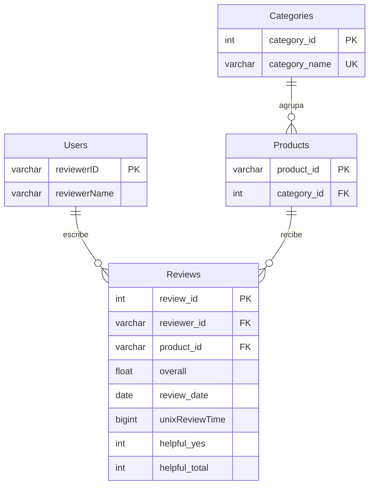

# Modelo de datos y decisiones

## MySQL

`reviewerID` y `asin` conservan los identificadores del dataset. Una clave de usuario común permite reunir actividad de varias categorías. Las fechas de texto se convierten a `date`; las fechas no interpretables devuelven `None`.

## MongoDB

La colección configurada en `MONGO_COLLECTION` almacena documentos con `review_id`, `summary`, `reviewText` y `helpful`. La carga inicial crea un índice único sobre `review_id`, que enlaza con la clave de MySQL. Ese índice no impide por sí mismo recargar una review si SQL le asigna un identificador nuevo.

## Neo4j

| Análisis | Nodos | Relaciones |
| --- | --- | --- |
| Similitudes | `User` | `SIMILAR`, con `similarity` |
| Valoraciones | `Usuario`, `Articulo` | `PUNTUO`, con nota y fecha |
| Diversidad de categorías | `Usuario`, `TipoArticulo` | `CONSUME`, con cantidad |
| Productos compartidos | `Usuario`, `Articulo` | `PUNTUO` y `EN_COMUN` |

Todos los nodos creados o consultados por el módulo llevan además la etiqueta `AmazonReviewsProject`. El reseteo de la visualización elimina únicamente esos nodos y las relaciones que incidan en ellos. No conviene conectar manualmente esos nodos con otras aplicaciones: esas relaciones también se eliminarían al cambiar de vista.

Se conserva la representación bidireccional original de similitud y productos comunes: se crean dos relaciones dirigidas por pareja. Al contar vecinos debe distinguirse entre vecinos distintos y número de relaciones.

## Similitud

`pearson_correlation` calcula la correlación usando las valoraciones de los productos comunes y sus medias sobre ese conjunto. Si no hay productos comunes o el denominador es cero, devuelve `None` y no crea una relación de similitud. Con un único producto común, Pearson no está definido.

El enunciado expresa la similitud centrando por la media de todas las valoraciones de cada usuario. La implementación original utiliza medias sobre la intersección. Se conserva su comportamiento y se documenta la diferencia, en lugar de presentar ambas fórmulas como equivalentes.

## Recomendador

La consulta filtra una categoría, excluye los productos ya valorados por el usuario, cuenta las reviews por producto y ordena por popularidad descendente y por identificador ascendente en los empates. Devuelve hasta diez resultados. La personalización consiste en excluir el historial; no se calcula una puntuación individual de afinidad.
